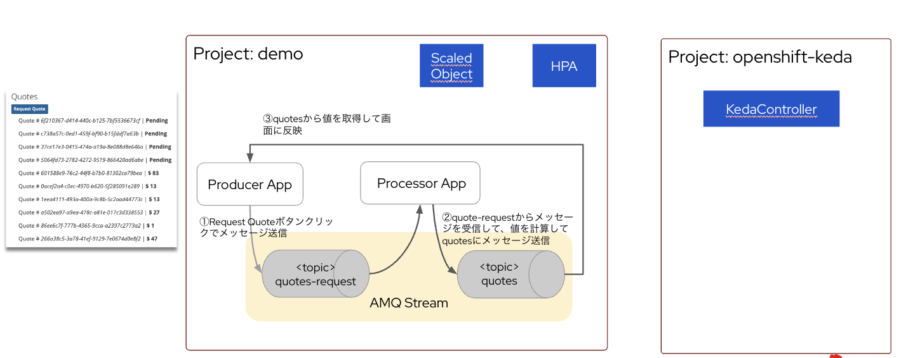

# Kafka App 



## OpenShiftへのデプロイ

JDK の s2i ビルドを利用する場合には、Runnable Jarを生成する必要があるので、pom.xml に `<quarkus.package.true>uber-jar</quarkus.package.type>`　が必要。

```
    <properties>
        <quarkus.package.type>uber-jar</quarkus.package.type>
    </properties>
```

## processor
`KAKFA_BOOTSTRAP_SERVERS` 環境変数の設定が必要。
kafkaを my-clusterという名前で追加した場合こうなる。
```
KAFKA_BOOTSTRAP_SERVERS: my-cluster-kafka-bootstrap:9092
```

スケールした時にoffsetを共有できるように consumer group を application.propertiesに設定しておく。
ここで指定したconsumer groupの名前をscaledObjectにも設定する。


```
%dev.quarkus.http.port=8081

# Go bad to the first records, if it's out first access
kafka.auto.offset.reset=earliest

# Set the Kafka topic, as it's not the channel name
mp.messaging.incoming.requests.topic=quote-requests


# Configure the outgoing `quotes` Kafka topic
mp.messaging.outgoing.quotes.value.serializer=io.quarkus.kafka.client.serialization.ObjectMapperSerializer

mp.messaging.incoming.requests.group.id=mygroup
```


## producer
`KAKFA_BOOTSTRAP_SERVERS` 環境変数の設定が必要。
kafkaを my-clusterという名前で追加した場合こうなる。
```
KAFKA_BOOTSTRAP_SERVERS: my-cluster-kafka-bootstrap:9092
```


## Topic 送受信テスト

```
oc run kafka-consumer -ti \
--image=registry.redhat.io/amq-streams/kafka-36-rhel8:2.6.0 \
--rm=true \
--restart=Never \
-- bin/kafka-console-consumer.sh \
--bootstrap-server my-cluster-kafka-bootstrap:9092 \
--topic quote-requests \
--from-beginning


oc run kafka-producer -ti \
--image=registry.redhat.io/amq-streams/kafka-36-rhel8:2.6.0 \
--rm=true \
--restart=Never \
-- bin/kafka-console-producer.sh \
--bootstrap-server my-cluster-kafka-bootstrap:9092 \
--topic quote-requests
```
